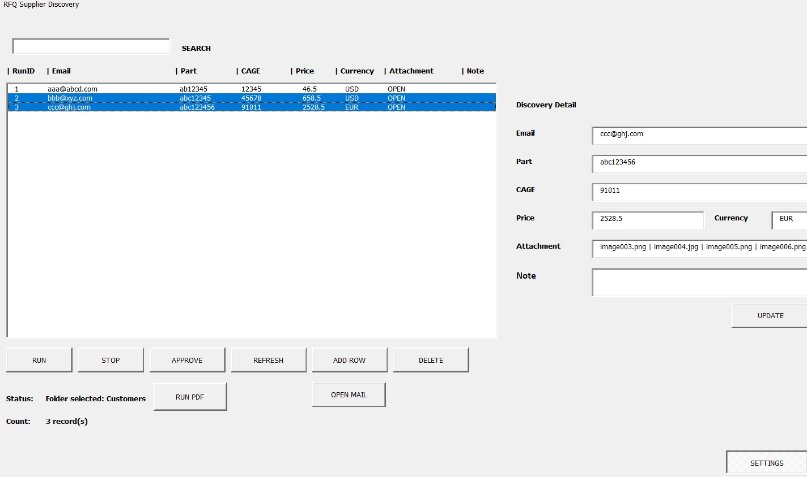
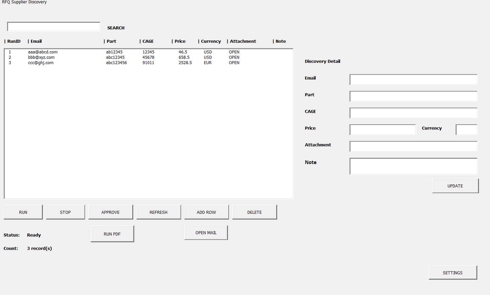
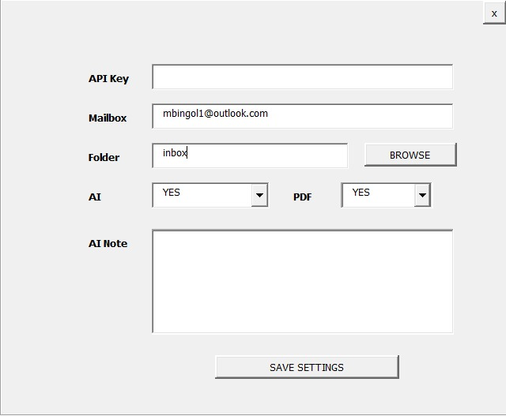

# RFQ Supplier Discovery (Excel VBA)

## 🚀 Overview

Do you have years of accumulated RFQ emails in Outlook?

* Are you constantly searching old emails for supplier quotes?
* Do you struggle to remember which supplier quoted which part number?
* Are thousands of emails overwhelming and impossible to analyze manually?

If yes, this tool is built for you.

This Excel VBA solution transforms your Outlook inbox into a structured, searchable, and intelligent supplier database using AI.

---

## 💡 Why This Tool?

It's time to build your own **EmailBook**.

* A centralized supplier intelligence system
* Based on real RFQ email history
* Built automatically from your Outlook

No more digging through emails.

Instead, you get:

* 🎯 Accurate supplier matching
* 📦 Part number → supplier mapping
* 💰 Price visibility
* 🔁 Alternative supplier discovery

---

## 🔥 What You Gain

* Know exactly **who quoted which part**
* Build a reliable **supplier database**
* Request quotes faster from **the right suppliers**
* Reduce manual workload drastically
* Turn email chaos into structured data

---

## ⚡ Smart RFQ Workflow

Finding the right supplier is no longer manual.

✔ Target the correct suppliers instantly
✔ Send RFQs with precision
✔ Request pricing from alternative manufacturers
✔ Improve sourcing speed and accuracy

👉 The right supplier is now **just one click away**

---

## 🤖 Features

* Outlook email scanning
* Automatic attachment saving
* AI-based data extraction:

  * RFQ
  * Part Number
  * CAGE Code
  * Price
  * Currency
* Excel-based data structure
* Supplier discovery system
* Approval workflow
* PDF extraction via Microsoft Word

---

## 📄 Upcoming Feature

🚀 **Automatic RFQ Email Sender Module (Coming Soon)**

Send RFQs directly to the right suppliers with a single click.

---

## 🧠 How It Works

1. Select Outlook folder
2. Run the system
3. Emails are processed automatically
4. AI extracts supplier data
5. Results are stored in Excel

---

## 📷 Screenshots

### Supplier Discovery

### User Interface

### Settings Screen

---

## 🛠 Requirements

* Microsoft Excel
* Microsoft Outlook
* Microsoft Word
* OpenAI API Key

---

## 👨‍💻 Author

Excel VBA Automation Developer
Building real-world business tools

💼 Open for freelance automation projects
